# CLASS.md

## 凡例

| 記号 | 意味 |
|---|---|
| `PK` | 主キー |
| `FK` | 外部キー（論理） |
| `UQ` | ユニーク |
| `NULL` | NULL 許可 |
| `<<enum>>` | 列挙型 |
| `<<IndexedDB>>` | クライアント側ストア |
| `<<SQLite>>` | サーバー側テーブル |

---

## 1. 列挙型

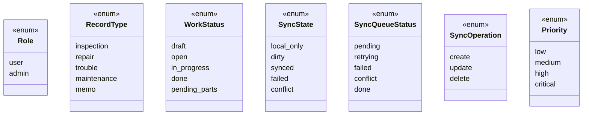

---

## 2. サーバー側クラス図（SQLite）

### 2.1 ユーザー・認証

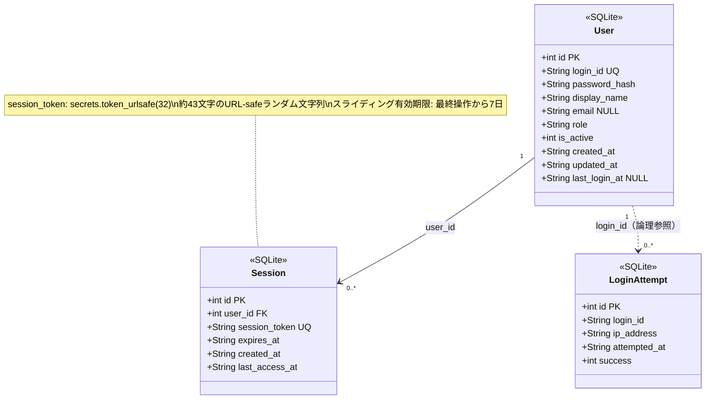

---

### 2.2 業務データ

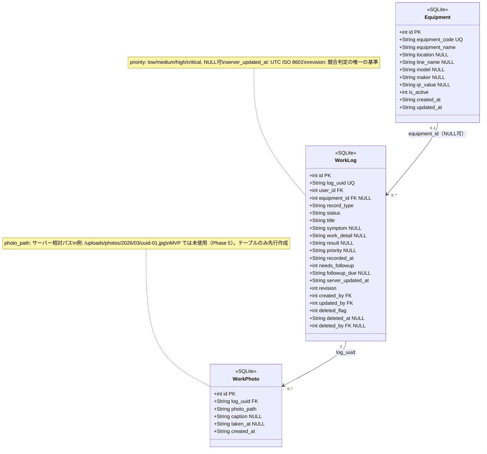

---

### 2.3 サーバー全体関係

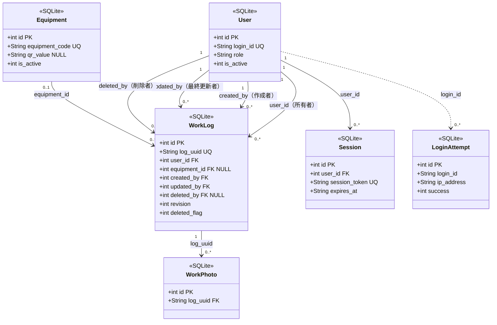

---

## 3. クライアント側クラス図（IndexedDB）

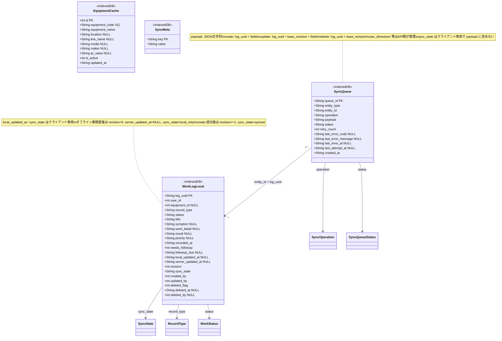

---

## 4. サーバー ↔ クライアント 対応関係

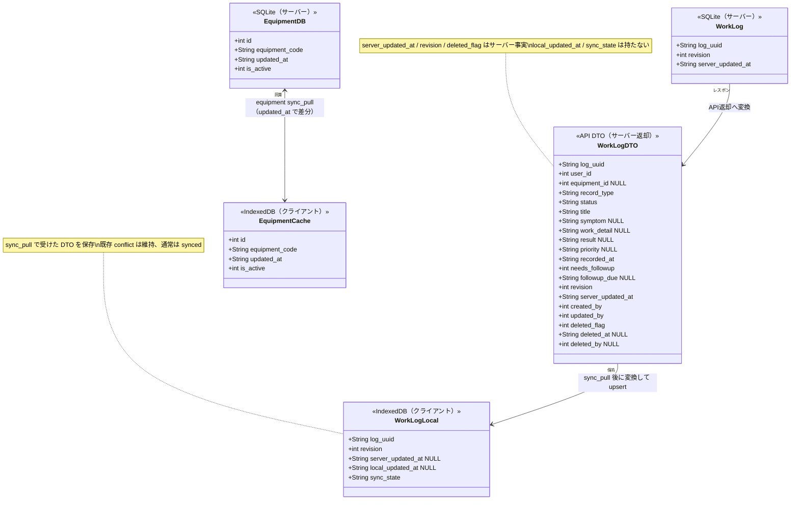

---

## 5. sync_push / sync_pull ペイロード構造

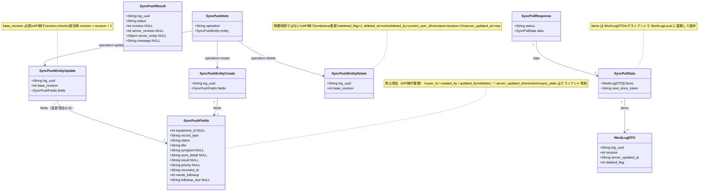

---

## 6. 型まとめ

### WorkLog.record_type
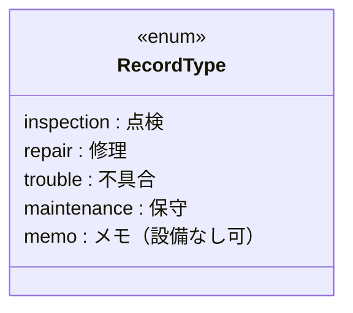

### WorkLog.status
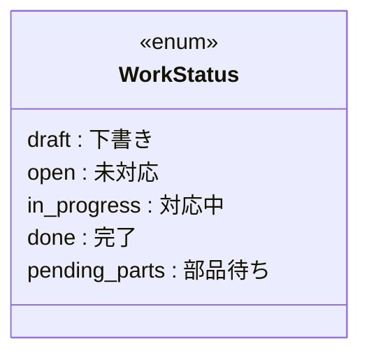

### WorkLog.sync_state（クライアント）
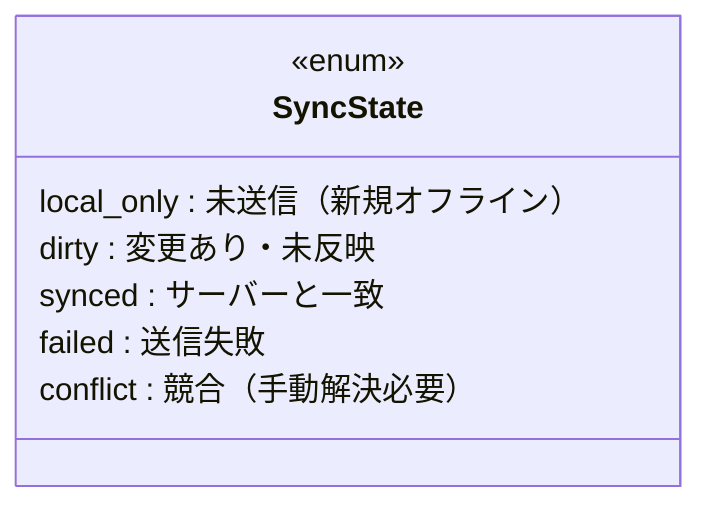

### SyncQueue.status / operation
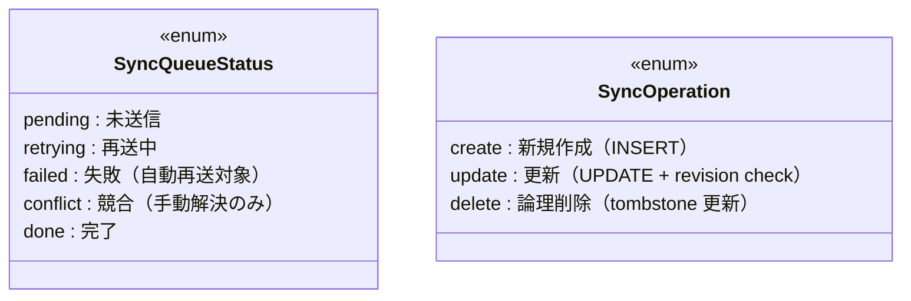

### WorkLog.priority
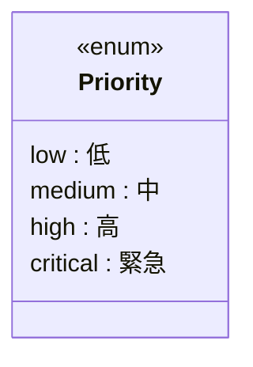

> NULL 許可（「未設定」を意味する）。MVP では入力必須にしない。
> 一覧の絞り込み対象には含めない。詳細画面では表示可。

### Session.session_token 生成方式
- `secrets.token_urlsafe(32)`（Python 標準ライブラリ）
- 約 43 文字の URL-safe ランダム文字列
- DB 上は `TEXT UNIQUE`

### WorkPhoto.photo_path 保存形式
- サーバー相対パスで保存（例: `/uploads/photos/2026/03/uuid-01.jpg`）
- フル URL は保存しない
- クライアントは API ベース URL に連結して表示する
