# SEQUENCE.md

## 登場人物

| 略称 | 説明 |
|---|---|
| User | ブラウザ操作者（User / Admin 共通） |
| Browser | ブラウザ / PWA フロントエンド |
| IDB | IndexedDB（ローカルストレージ） |
| API | Sakura Python CGI |
| DB | SQLite |

---

## 1. 認証系

### SEQ-1: 新規登録

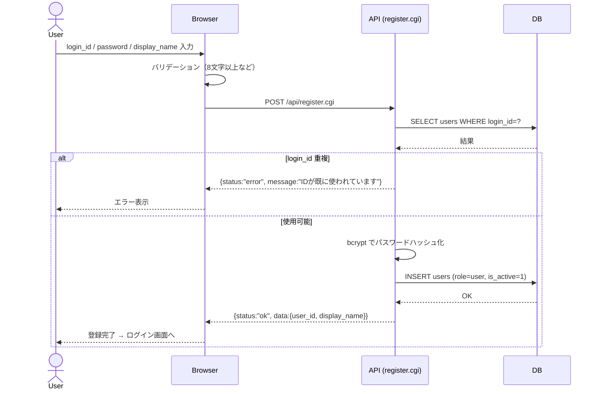
```mermaid
sequenceDiagram
  actor User
  participant Browser
  participant API as API (register.cgi)
  participant DB

  User->>Browser: login_id / password / display_name 入力
  Browser->>Browser: バリデーション（8文字以上など）
  Browser->>API: POST /api/register.cgi
  API->>DB: SELECT users WHERE login_id=?
  DB-->>API: 結果
  alt login_id 重複
    API-->>Browser: {status:"error", message:"IDが既に使われています"}
    Browser-->>User: エラー表示
  else 使用可能
    API->>API: bcrypt でパスワードハッシュ化
    API->>DB: INSERT users (role=user, is_active=1)
    DB-->>API: OK
    API-->>Browser: {status:"ok", data:{user_id, display_name}}
    Browser-->>User: 登録完了 → ログイン画面へ
  end
```

---

### SEQ-2: ログイン（成功）

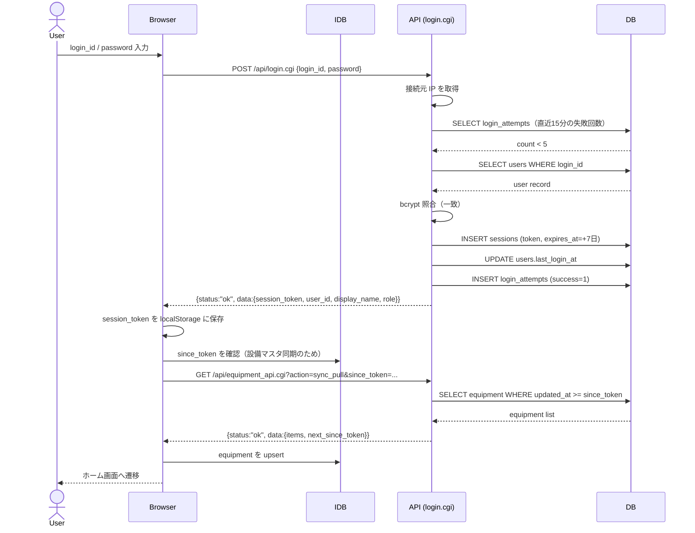
```mermaid
sequenceDiagram
  actor User
  participant Browser
  participant IDB
  participant API as API (login.cgi)
  participant DB

  User->>Browser: login_id / password 入力
  Browser->>API: POST /api/login.cgi {login_id, password}
  API->>API: 接続元 IP を取得
  API->>DB: SELECT login_attempts（直近15分の失敗回数）
  DB-->>API: count < 5
  API->>DB: SELECT users WHERE login_id
  DB-->>API: user record
  API->>API: bcrypt 照合（一致）
  API->>DB: INSERT sessions (token, expires_at=+7日)
  API->>DB: UPDATE users.last_login_at
  API->>DB: INSERT login_attempts (success=1)
  API-->>Browser: {status:"ok", data:{session_token, user_id, display_name, role}}
  Browser->>Browser: session_token を localStorage に保存
  Browser->>IDB: since_token を確認（設備マスタ同期のため）
  Browser->>API: GET /api/equipment_api.cgi?action=sync_pull&since_token=...
  API->>DB: SELECT equipment WHERE updated_at >= since_token
  DB-->>API: equipment list
  API-->>Browser: {status:"ok", data:{items, next_since_token}}
  Browser->>IDB: equipment を upsert
  Browser-->>User: ホーム画面へ遷移
```

---

### SEQ-3: ログイン（試行制限・ロック）

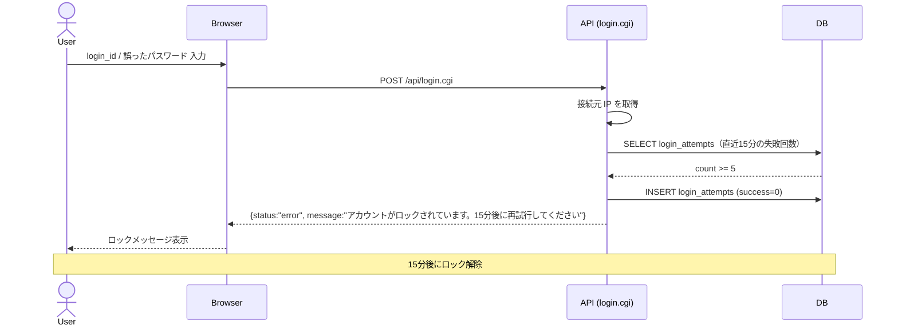
```mermaid
sequenceDiagram
  actor User
  participant Browser
  participant API as API (login.cgi)
  participant DB

  User->>Browser: login_id / 誤ったパスワード 入力
  Browser->>API: POST /api/login.cgi
  API->>API: 接続元 IP を取得
  API->>DB: SELECT login_attempts（直近15分の失敗回数）
  DB-->>API: count >= 5
  API->>DB: INSERT login_attempts (success=0)
  API-->>Browser: {status:"error", message:"アカウントがロックされています。15分後に再試行してください"}
  Browser-->>User: ロックメッセージ表示
  Note over User,DB: 15分後にロック解除
```

---

### SEQ-4: ログアウト

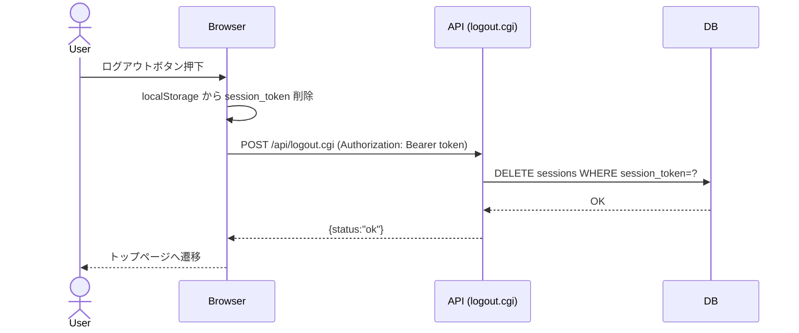
```mermaid
sequenceDiagram
  actor User
  participant Browser
  participant API as API (logout.cgi)
  participant DB

  User->>Browser: ログアウトボタン押下
  Browser->>Browser: localStorage から session_token 削除
  Browser->>API: POST /api/logout.cgi (Authorization: Bearer token)
  API->>DB: DELETE sessions WHERE session_token=?
  DB-->>API: OK
  API-->>Browser: {status:"ok"}
  Browser-->>User: トップページへ遷移
```

---

### SEQ-5: パスワード変更

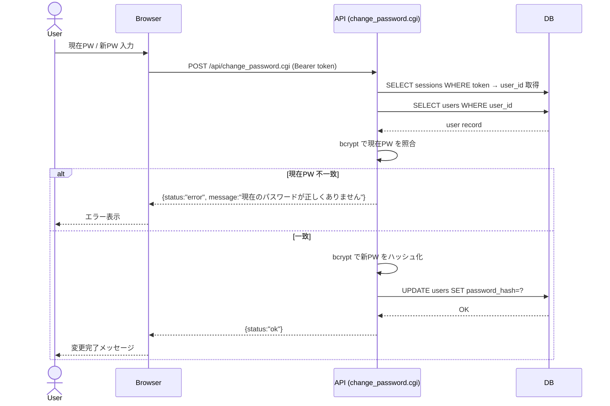
```mermaid
sequenceDiagram
  actor User
  participant Browser
  participant API as API (change_password.cgi)
  participant DB

  User->>Browser: 現在PW / 新PW 入力
  Browser->>API: POST /api/change_password.cgi (Bearer token)
  API->>DB: SELECT sessions WHERE token → user_id 取得
  API->>DB: SELECT users WHERE user_id
  DB-->>API: user record
  API->>API: bcrypt で現在PW を照合
  alt 現在PW 不一致
    API-->>Browser: {status:"error", message:"現在のパスワードが正しくありません"}
    Browser-->>User: エラー表示
  else 一致
    API->>API: bcrypt で新PW をハッシュ化
    API->>DB: UPDATE users SET password_hash=?
    DB-->>API: OK
    API-->>Browser: {status:"ok"}
    Browser-->>User: 変更完了メッセージ
  end
```

---

### SEQ-6: セッション期限切れ検知

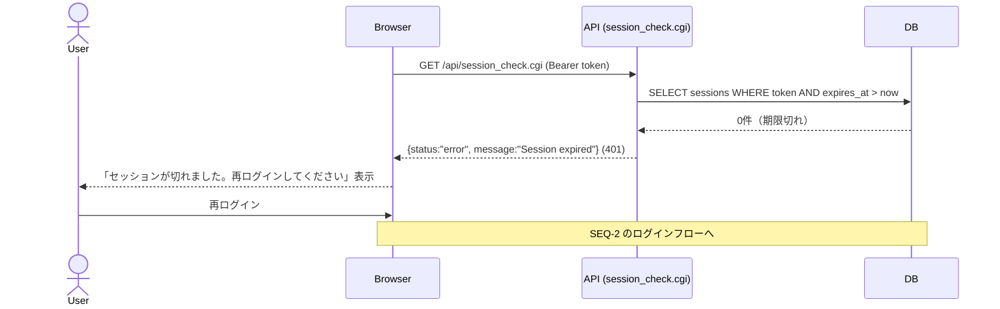
```mermaid
sequenceDiagram
  actor User
  participant Browser
  participant API as API (session_check.cgi)
  participant DB

  Browser->>API: GET /api/session_check.cgi (Bearer token)
  API->>DB: SELECT sessions WHERE token AND expires_at > now
  DB-->>API: 0件（期限切れ）
  API-->>Browser: {status:"error", message:"Session expired"} (401)
  Browser-->>User: 「セッションが切れました。再ログインしてください」表示
  User->>Browser: 再ログイン
  Note over Browser,DB: SEQ-2 のログインフローへ
```

---

## 2. 作業記録管理

### SEQ-7: 作業記録作成（オンライン）

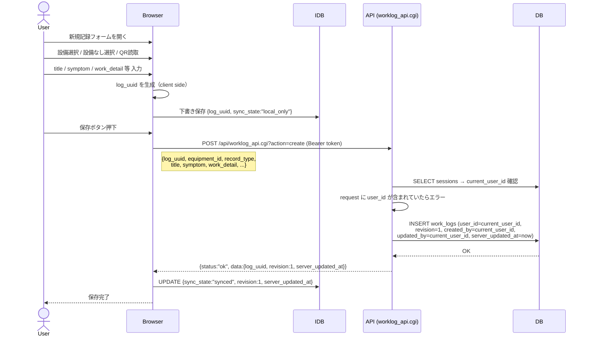
```mermaid
sequenceDiagram
  actor User
  participant Browser
  participant IDB
  participant API as API (worklog_api.cgi)
  participant DB

  User->>Browser: 新規記録フォームを開く
  User->>Browser: 設備選択 / 設備なし選択 / QR読取
  User->>Browser: title / symptom / work_detail 等 入力
  Browser->>Browser: log_uuid を生成（client side）
  Browser->>IDB: 下書き保存 {log_uuid, sync_state:"local_only"}
  User->>Browser: 保存ボタン押下
  Browser->>API: POST /api/worklog_api.cgi?action=create (Bearer token)
  Note right of Browser: {log_uuid, equipment_id, record_type,<br/>title, symptom, work_detail, ...}
  API->>DB: SELECT sessions → current_user_id 確認
  API->>API: request に user_id が含まれていたらエラー
  API->>DB: INSERT work_logs (user_id=current_user_id,<br/>revision=1, created_by=current_user_id,<br/>updated_by=current_user_id, server_updated_at=now)
  DB-->>API: OK
  API-->>Browser: {status:"ok", data:{log_uuid, revision:1, server_updated_at}}
  Browser->>IDB: UPDATE {sync_state:"synced", revision:1, server_updated_at}
  Browser-->>User: 保存完了
```

---

### SEQ-8: 作業記録作成（オフライン）

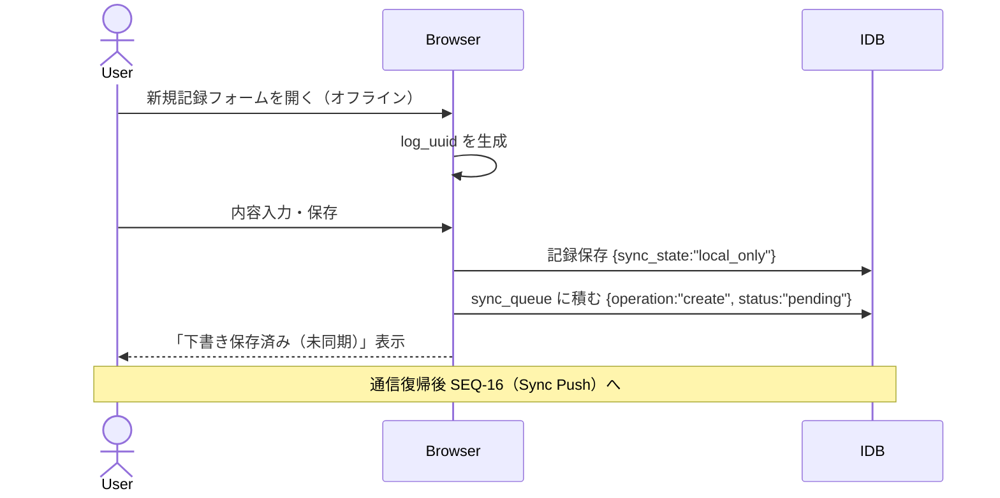
```mermaid
sequenceDiagram
  actor User
  participant Browser
  participant IDB

  User->>Browser: 新規記録フォームを開く（オフライン）
  Browser->>Browser: log_uuid を生成
  User->>Browser: 内容入力・保存
  Browser->>IDB: 記録保存 {sync_state:"local_only"}
  Browser->>IDB: sync_queue に積む {operation:"create", status:"pending"}
  Browser-->>User: 「下書き保存済み（未同期）」表示
  Note over User,IDB: 通信復帰後 SEQ-16（Sync Push）へ
```

---

### SEQ-9: 作業記録一覧表示

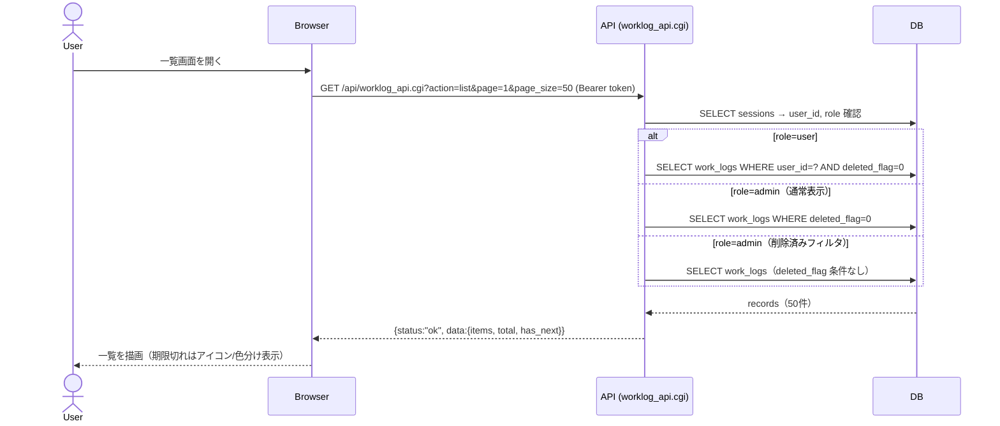
```mermaid
sequenceDiagram
  actor User
  participant Browser
  participant API as API (worklog_api.cgi)
  participant DB

  User->>Browser: 一覧画面を開く
  Browser->>API: GET /api/worklog_api.cgi?action=list&page=1&page_size=50 (Bearer token)
  API->>DB: SELECT sessions → user_id, role 確認
  alt role=user
    API->>DB: SELECT work_logs WHERE user_id=? AND deleted_flag=0
  else role=admin（通常表示）
    API->>DB: SELECT work_logs WHERE deleted_flag=0
  else role=admin（削除済みフィルタ）
    API->>DB: SELECT work_logs（deleted_flag 条件なし）
  end
  DB-->>API: records（50件）
  API-->>Browser: {status:"ok", data:{items, total, has_next}}
  Browser-->>User: 一覧を描画（期限切れはアイコン/色分け表示）
```

---

### SEQ-10: 作業記録編集（競合なし）

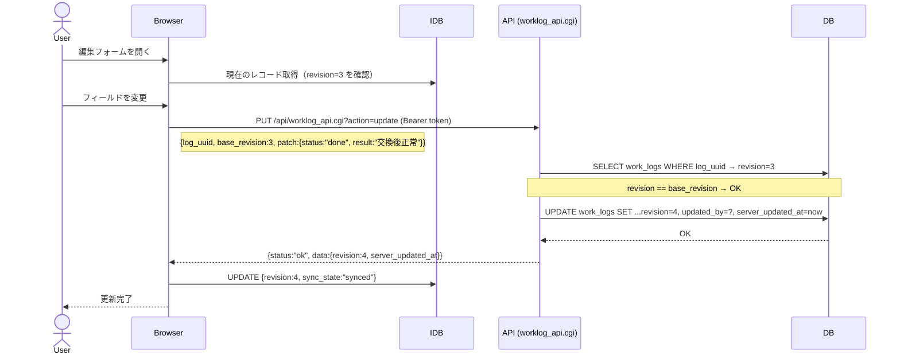
```mermaid
sequenceDiagram
  actor User
  participant Browser
  participant IDB
  participant API as API (worklog_api.cgi)
  participant DB

  User->>Browser: 編集フォームを開く
  Browser->>IDB: 現在のレコード取得（revision=3 を確認）
  User->>Browser: フィールドを変更
  Browser->>API: PUT /api/worklog_api.cgi?action=update (Bearer token)
  Note right of Browser: {log_uuid, base_revision:3, patch:{status:"done", result:"交換後正常"}}
  API->>DB: SELECT work_logs WHERE log_uuid → revision=3
  Note over API,DB: revision == base_revision → OK
  API->>DB: UPDATE work_logs SET ...revision=4, updated_by=?, server_updated_at=now
  DB-->>API: OK
  API-->>Browser: {status:"ok", data:{revision:4, server_updated_at}}
  Browser->>IDB: UPDATE {revision:4, sync_state:"synced"}
  Browser-->>User: 更新完了
```

---

### SEQ-11: 作業記録編集（409 Conflict）

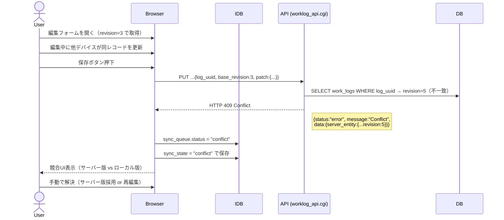
```mermaid
sequenceDiagram
  actor User
  participant Browser
  participant IDB
  participant API as API (worklog_api.cgi)
  participant DB

  User->>Browser: 編集フォームを開く（revision=3 で取得）
  User->>Browser: 編集中に他デバイスが同レコードを更新
  User->>Browser: 保存ボタン押下
  Browser->>API: PUT ...{log_uuid, base_revision:3, patch:{...}}
  API->>DB: SELECT work_logs WHERE log_uuid → revision=5（不一致）
  API-->>Browser: HTTP 409 Conflict
  Note right of API: {status:"error", message:"Conflict",<br/>data:{server_entity:{...revision:5}}}
  Browser->>IDB: sync_queue.status = "conflict"
  Browser->>IDB: sync_state = "conflict" で保存
  Browser-->>User: 競合UI表示（サーバー版 vs ローカル版）
  User->>Browser: 手動で解決（サーバー版採用 or 再編集）
```

---

### SEQ-12: 作業記録 論理削除

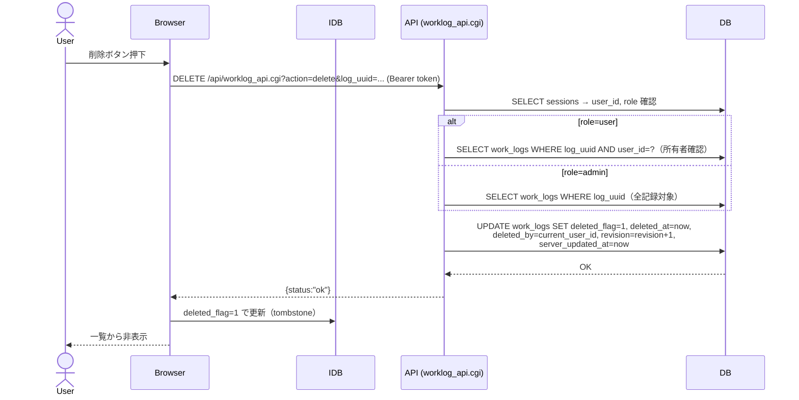
```mermaid
sequenceDiagram
  actor User
  participant Browser
  participant IDB
  participant API as API (worklog_api.cgi)
  participant DB

  User->>Browser: 削除ボタン押下
  Browser->>API: DELETE /api/worklog_api.cgi?action=delete&log_uuid=... (Bearer token)
  API->>DB: SELECT sessions → user_id, role 確認
  alt role=user
    API->>DB: SELECT work_logs WHERE log_uuid AND user_id=?（所有者確認）
  else role=admin
    API->>DB: SELECT work_logs WHERE log_uuid（全記録対象）
  end
  API->>DB: UPDATE work_logs SET deleted_flag=1, deleted_at=now,<br/>deleted_by=current_user_id, revision=revision+1,<br/>server_updated_at=now
  DB-->>API: OK
  API-->>Browser: {status:"ok"}
  Browser->>IDB: deleted_flag=1 で更新（tombstone）
  Browser-->>User: 一覧から非表示
```

---

## 3. 設備・QR

### SEQ-13: QR 読取①（ローカルキャッシュヒット）

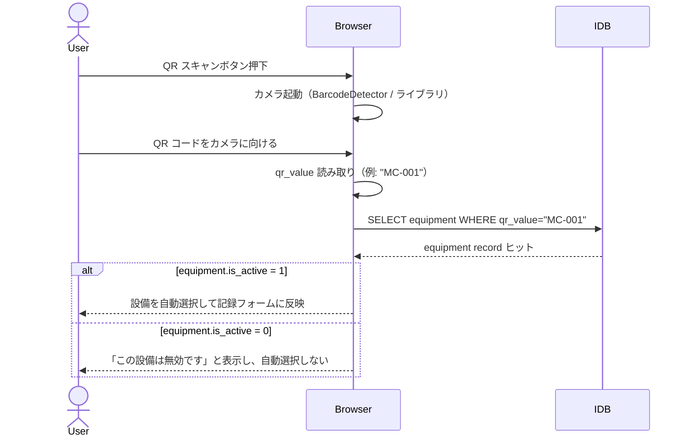
```mermaid
sequenceDiagram
  actor User
  participant Browser
  participant IDB

  User->>Browser: QR スキャンボタン押下
  Browser->>Browser: カメラ起動（BarcodeDetector / ライブラリ）
  User->>Browser: QR コードをカメラに向ける
  Browser->>Browser: qr_value 読み取り（例: "MC-001"）
  Browser->>IDB: SELECT equipment WHERE qr_value="MC-001"
  IDB-->>Browser: equipment record ヒット
  alt equipment.is_active = 1
    Browser-->>User: 設備を自動選択して記録フォームに反映
  else equipment.is_active = 0
    Browser-->>User: 「この設備は無効です」と表示し、自動選択しない
  end
```

---

### SEQ-14: QR 読取②（キャッシュミス・オンライン照会）

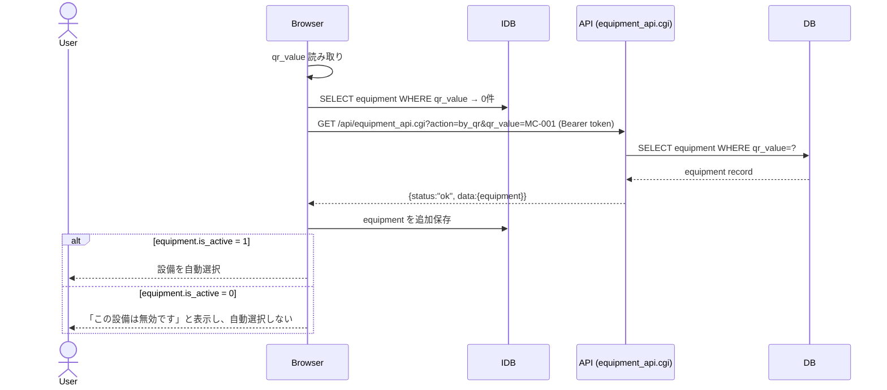
```mermaid
sequenceDiagram
  actor User
  participant Browser
  participant IDB
  participant API as API (equipment_api.cgi)
  participant DB

  Browser->>Browser: qr_value 読み取り
  Browser->>IDB: SELECT equipment WHERE qr_value → 0件
  Browser->>API: GET /api/equipment_api.cgi?action=by_qr&qr_value=MC-001 (Bearer token)
  API->>DB: SELECT equipment WHERE qr_value=?
  DB-->>API: equipment record
  API-->>Browser: {status:"ok", data:{equipment}}
  Browser->>IDB: equipment を追加保存
  alt equipment.is_active = 1
    Browser-->>User: 設備を自動選択
  else equipment.is_active = 0
    Browser-->>User: 「この設備は無効です」と表示し、自動選択しない
  end
```

---

### SEQ-15: QR 読取③（キャッシュミス・オフライン）

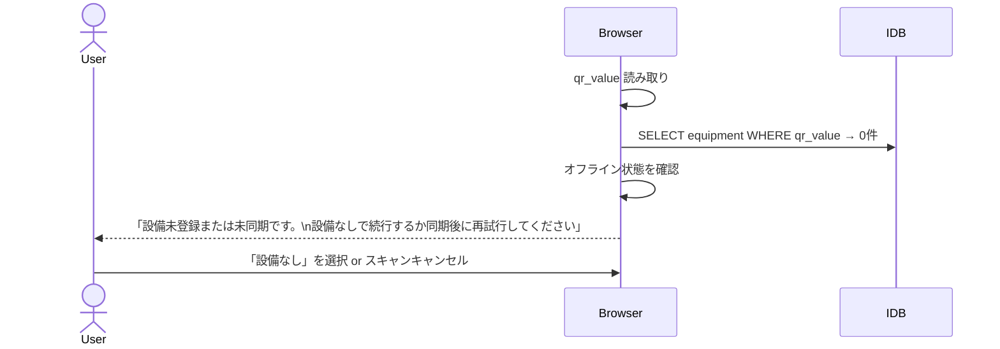
```mermaid
sequenceDiagram
  actor User
  participant Browser
  participant IDB

  Browser->>Browser: qr_value 読み取り
  Browser->>IDB: SELECT equipment WHERE qr_value → 0件
  Browser->>Browser: オフライン状態を確認
  Browser-->>User: 「設備未登録または未同期です。\n設備なしで続行するか同期後に再試行してください」
  User->>Browser: 「設備なし」を選択 or スキャンキャンセル
```

---

## 4. オフライン・同期

### SEQ-16: Sync Push（全件成功）

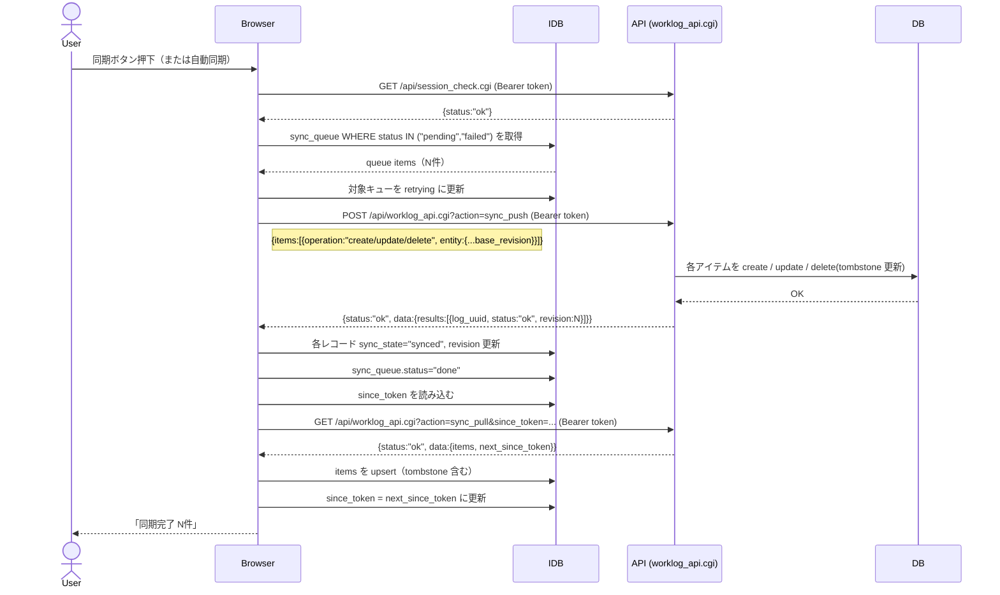
```mermaid
sequenceDiagram
  actor User
  participant Browser
  participant IDB
  participant API as API (worklog_api.cgi)
  participant DB

  User->>Browser: 同期ボタン押下（または自動同期）
  Browser->>API: GET /api/session_check.cgi (Bearer token)
  API-->>Browser: {status:"ok"}
  Browser->>IDB: sync_queue WHERE status IN ("pending","failed") を取得
  IDB-->>Browser: queue items（N件）
  Browser->>IDB: 対象キューを retrying に更新
  Browser->>API: POST /api/worklog_api.cgi?action=sync_push (Bearer token)
  Note right of Browser: {items:[{operation:"create/update/delete", entity:{...base_revision}}]}
  API->>DB: 各アイテムを create / update / delete(tombstone 更新)
  DB-->>API: OK
  API-->>Browser: {status:"ok", data:{results:[{log_uuid, status:"ok", revision:N}]}}
  Browser->>IDB: 各レコード sync_state="synced", revision 更新
  Browser->>IDB: sync_queue.status="done"
  Browser->>IDB: since_token を読み込む
  Browser->>API: GET /api/worklog_api.cgi?action=sync_pull&since_token=... (Bearer token)
  API-->>Browser: {status:"ok", data:{items, next_since_token}}
  Browser->>IDB: items を upsert（tombstone 含む）
  Browser->>IDB: since_token = next_since_token に更新
  Browser-->>User: 「同期完了 N件」
```

---

### SEQ-17: Sync Push（競合・エラー混在）

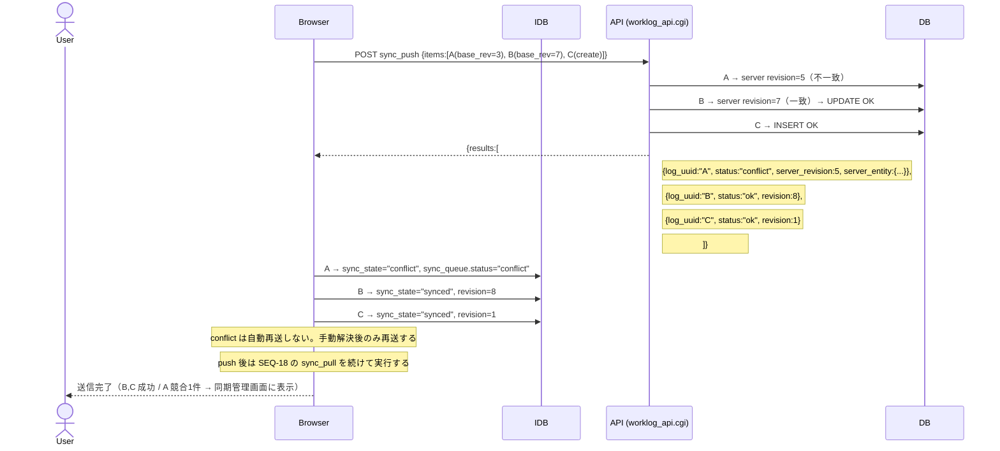
```mermaid
sequenceDiagram
  actor User
  participant Browser
  participant IDB
  participant API as API (worklog_api.cgi)
  participant DB

  Browser->>API: POST sync_push {items:[A(base_rev=3), B(base_rev=7), C(create)]}
  API->>DB: A → server revision=5（不一致）
  API->>DB: B → server revision=7（一致）→ UPDATE OK
  API->>DB: C → INSERT OK
  API-->>Browser: {results:[
  Note right of API:   {log_uuid:"A", status:"conflict", server_revision:5, server_entity:{...}},
  Note right of API:   {log_uuid:"B", status:"ok", revision:8},
  Note right of API:   {log_uuid:"C", status:"ok", revision:1}
  Note right of API: ]}
  Browser->>IDB: A → sync_state="conflict", sync_queue.status="conflict"
  Browser->>IDB: B → sync_state="synced", revision=8
  Browser->>IDB: C → sync_state="synced", revision=1
  Note over Browser: conflict は自動再送しない。手動解決後のみ再送する
  Note over Browser: push 後は SEQ-18 の sync_pull を続けて実行する
  Browser-->>User: 送信完了（B,C 成功 / A 競合1件 → 同期管理画面に表示）
```

---

### SEQ-18: Sync Pull（差分取得）

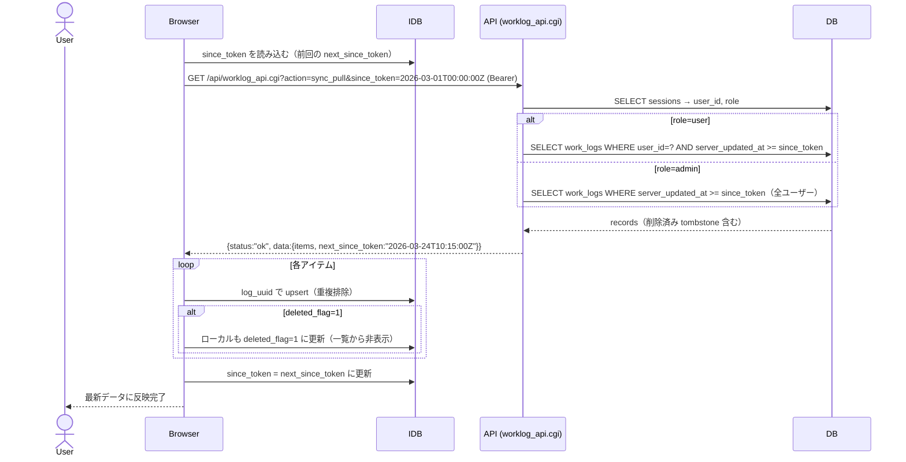
```mermaid
sequenceDiagram
  actor User
  participant Browser
  participant IDB
  participant API as API (worklog_api.cgi)
  participant DB

  Browser->>IDB: since_token を読み込む（前回の next_since_token）
  Browser->>API: GET /api/worklog_api.cgi?action=sync_pull&since_token=2026-03-01T00:00:00Z (Bearer)
  API->>DB: SELECT sessions → user_id, role
  alt role=user
    API->>DB: SELECT work_logs WHERE user_id=? AND server_updated_at >= since_token
  else role=admin
    API->>DB: SELECT work_logs WHERE server_updated_at >= since_token（全ユーザー）
  end
  DB-->>API: records（削除済み tombstone 含む）
  API-->>Browser: {status:"ok", data:{items, next_since_token:"2026-03-24T10:15:00Z"}}
  loop 各アイテム
    Browser->>IDB: log_uuid で upsert（重複排除）
    alt deleted_flag=1
      Browser->>IDB: ローカルも deleted_flag=1 に更新（一覧から非表示）
    end
  end
  Browser->>IDB: since_token = next_since_token に更新
  Browser-->>User: 最新データに反映完了
```

---

### SEQ-19: 設備マスタ同期（ログイン時自動）

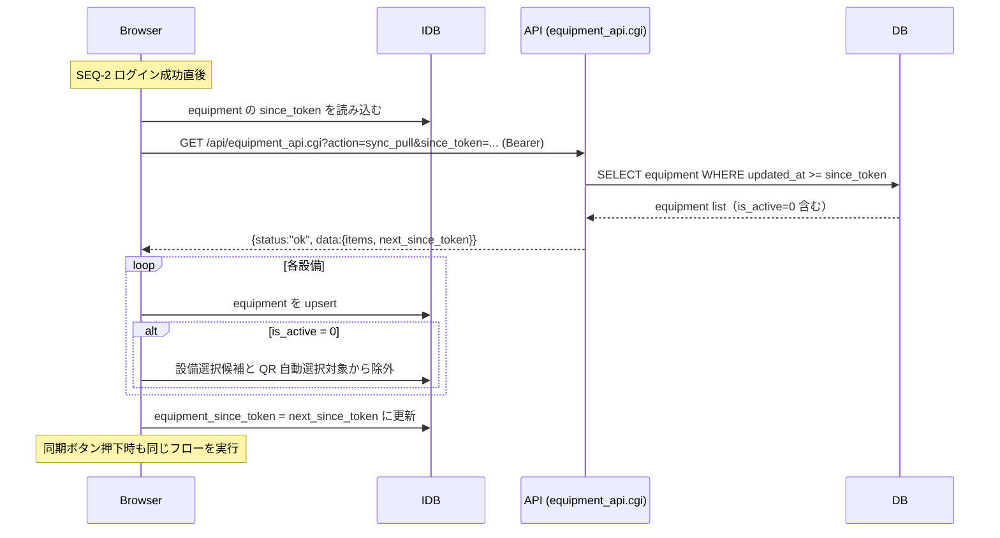
```mermaid
sequenceDiagram
  participant Browser
  participant IDB
  participant API as API (equipment_api.cgi)
  participant DB

  Note over Browser: SEQ-2 ログイン成功直後
  Browser->>IDB: equipment の since_token を読み込む
  Browser->>API: GET /api/equipment_api.cgi?action=sync_pull&since_token=... (Bearer)
  API->>DB: SELECT equipment WHERE updated_at >= since_token
  DB-->>API: equipment list（is_active=0 含む）
  API-->>Browser: {status:"ok", data:{items, next_since_token}}
  loop 各設備
    Browser->>IDB: equipment を upsert
    alt is_active = 0
      Browser->>IDB: 設備選択候補と QR 自動選択対象から除外
    end
  end
  Browser->>IDB: equipment_since_token = next_since_token に更新
  Note over Browser: 同期ボタン押下時も同じフローを実行
```

---

### SEQ-20: オフライン中セッション期限切れ → 再ログイン後同期

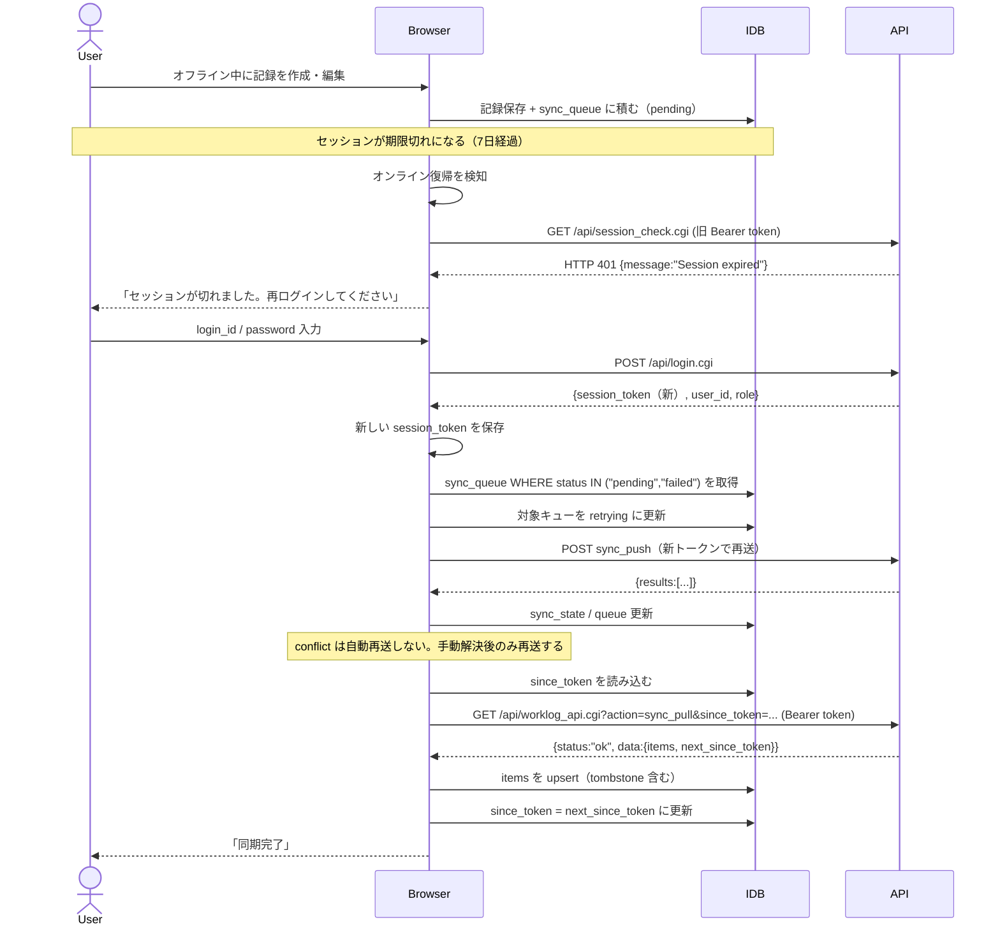
```mermaid
sequenceDiagram
  actor User
  participant Browser
  participant IDB
  participant API as API

  User->>Browser: オフライン中に記録を作成・編集
  Browser->>IDB: 記録保存 + sync_queue に積む（pending）
  Note over User,IDB: セッションが期限切れになる（7日経過）
  Browser->>Browser: オンライン復帰を検知
  Browser->>API: GET /api/session_check.cgi (旧 Bearer token)
  API-->>Browser: HTTP 401 {message:"Session expired"}
  Browser-->>User: 「セッションが切れました。再ログインしてください」
  User->>Browser: login_id / password 入力
  Browser->>API: POST /api/login.cgi
  API-->>Browser: {session_token（新）, user_id, role}
  Browser->>Browser: 新しい session_token を保存
  Browser->>IDB: sync_queue WHERE status IN ("pending","failed") を取得
  Browser->>IDB: 対象キューを retrying に更新
  Browser->>API: POST sync_push（新トークンで再送）
  API-->>Browser: {results:[...]}
  Browser->>IDB: sync_state / queue 更新
  Note over Browser: conflict は自動再送しない。手動解決後のみ再送する
  Browser->>IDB: since_token を読み込む
  Browser->>API: GET /api/worklog_api.cgi?action=sync_pull&since_token=... (Bearer token)
  API-->>Browser: {status:"ok", data:{items, next_since_token}}
  Browser->>IDB: items を upsert（tombstone 含む）
  Browser->>IDB: since_token = next_since_token に更新
  Browser-->>User: 「同期完了」
```

---

## 5. 管理者専用

### SEQ-21: ユーザー一覧取得・is_active 変更

```mermaid
sequenceDiagram
  actor Admin
  participant Browser
  participant API as API (admin_api.cgi)
  participant DB

  Admin->>Browser: ユーザー管理画面を開く
  Browser->>API: GET /api/admin_api.cgi?action=user_list (Bearer token)
  API->>DB: SELECT sessions → role=admin 確認
  API->>DB: SELECT users ORDER BY created_at
  DB-->>API: user list
  API-->>Browser: {status:"ok", data:{items:[{user_id, login_id, display_name, role, is_active}]}}
  Browser-->>Admin: 一覧表示

  Admin->>Browser: 対象ユーザーの「無効化」ボタン押下
  Browser->>API: PUT /api/admin_api.cgi?action=set_active (Bearer token)
  Note right of Browser: {user_id:42, is_active:0}
  API->>DB: role=admin 確認 / 自身でないことを確認
  API->>DB: UPDATE users SET is_active=0 WHERE user_id=42
  DB-->>API: OK
  API-->>Browser: {status:"ok"}
  Browser-->>Admin: UI 更新（無効化済み表示）
```

---

### SEQ-22: role 変更（昇格・降格）

```mermaid
sequenceDiagram
  actor Admin
  participant Browser
  participant API as API (admin_api.cgi)
  participant DB

  Admin->>Browser: 対象ユーザーの「admin 昇格」ボタン押下
  Browser->>API: PUT /api/admin_api.cgi?action=set_role (Bearer token)
  Note right of Browser: {user_id:55, role:"admin"}
  API->>DB: SELECT sessions → 操作者が role=admin か確認
  API->>DB: 降格の場合 → SELECT COUNT(*) WHERE role=admin（最後の1人ガード）
  alt 最後の1人の admin を降格しようとした
    API-->>Browser: {status:"error", message:"最後の管理者は降格できません"}
    Browser-->>Admin: エラー表示
  else 安全
    API->>DB: UPDATE users SET role=? WHERE user_id=?
    DB-->>API: OK
    API-->>Browser: {status:"ok"}
    Browser-->>Admin: UI 更新
  end
```

---

### SEQ-23: 仮パスワード再設定

```mermaid
sequenceDiagram
  actor Admin
  participant Browser
  participant API as API (admin_api.cgi)
  participant DB

  Admin->>Browser: 対象ユーザーの「パスワードリセット」ボタン押下
  Browser->>API: POST /api/admin_api.cgi?action=reset_password (Bearer token)
  Note right of Browser: {user_id:42}
  API->>DB: SELECT sessions → role=admin 確認
  API->>API: ランダムな仮パスワード生成（英数字8文字以上）
  API->>API: bcrypt でハッシュ化
  API->>DB: UPDATE users SET password_hash=hashed_temp WHERE user_id=42
  DB-->>API: OK
  API-->>Browser: {status:"ok", data:{temp_password:"xK9pM3qZ"}}
  Browser-->>Admin: モーダルで仮パスワードを一時表示
  Note over Admin,Browser: Admin が仮パスワードを対象ユーザーに伝達
  Note over Admin,Browser: 対象ユーザーは次回ログイン後にパスワード変更推奨
```

---

### SEQ-24: 集計ダッシュボード取得

```mermaid
sequenceDiagram
  actor Admin
  participant Browser
  participant API as API (admin_api.cgi)
  participant DB

  Admin->>Browser: 集計ダッシュボード画面を開く
  Browser->>API: GET /api/admin_api.cgi?action=dashboard (Bearer token)
  API->>DB: SELECT sessions → role=admin 確認
  API->>DB: 期間別件数（今日 / 直近7日 / 直近30日）
  API->>DB: status 別件数（draft / open / in_progress / done / pending_parts）
  API->>DB: record_type 別件数
  API->>DB: フォローアップ期限超過件数（needs_followup=1 AND followup_due < now）
  API->>DB: ユーザー別記録件数
  API->>DB: 設備別記録件数（上位N件）
  DB-->>API: 各集計結果
  API-->>Browser: {status:"ok", data:{by_period:{...}, by_status:{...}, by_type:{...},<br/>followup_overdue:N, by_user:[...], by_equipment_top:[...]}}
  Browser-->>Admin: ダッシュボード描画
```
