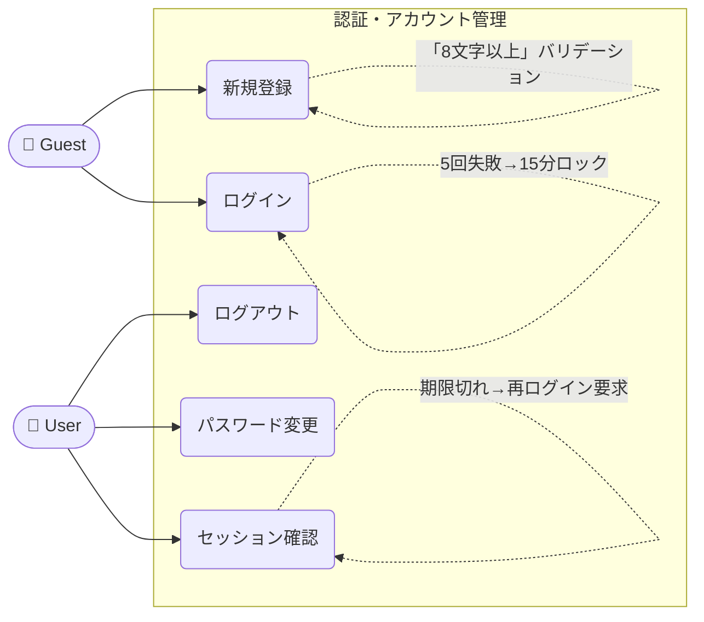
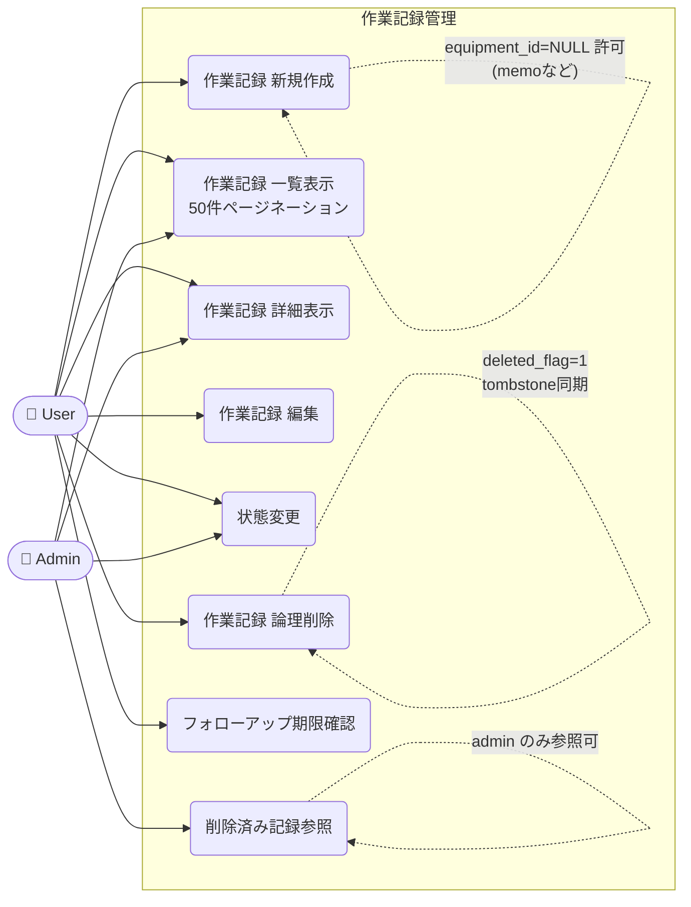
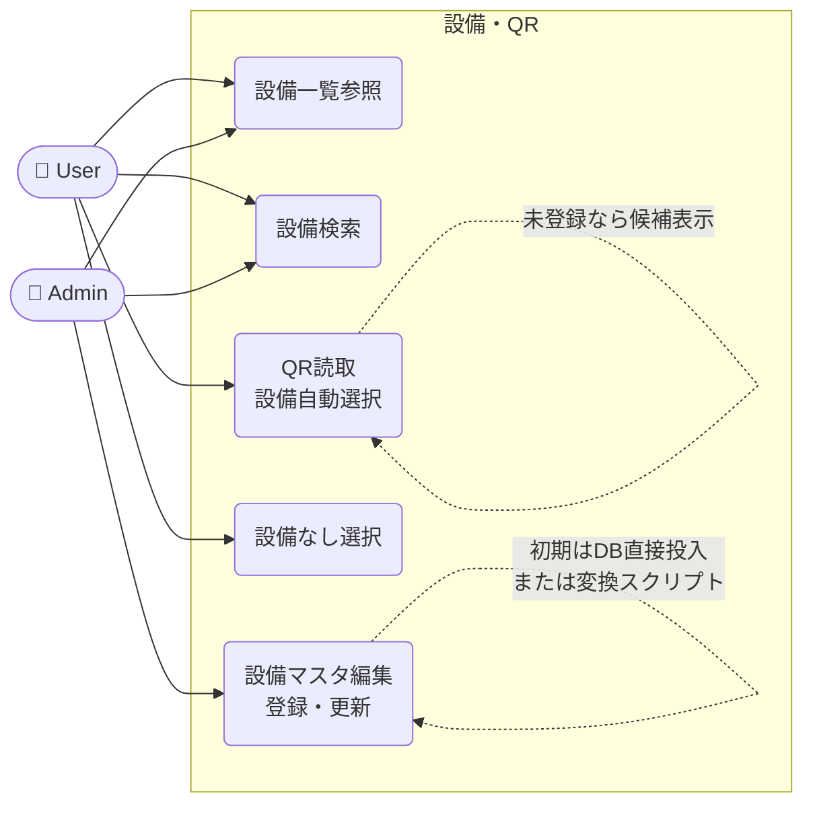
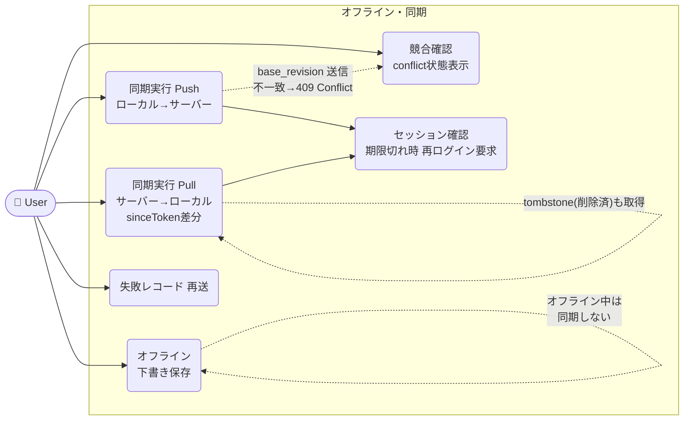
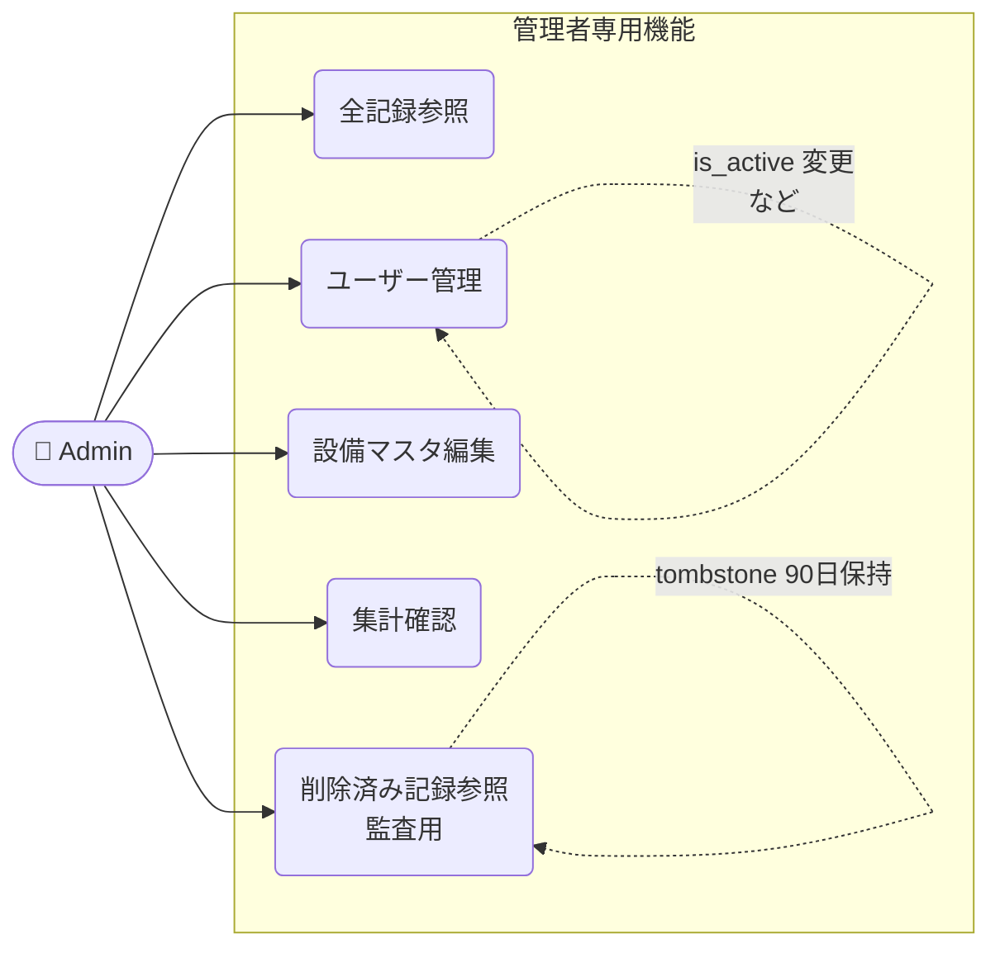
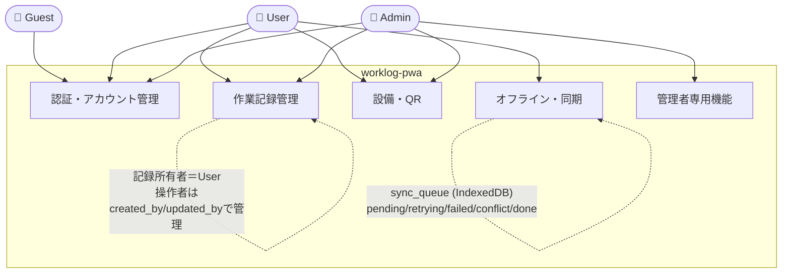
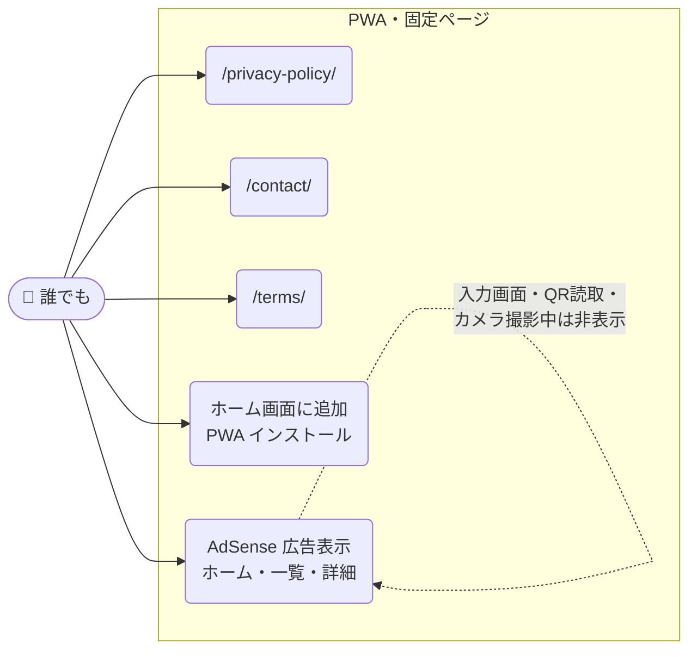

# USECASE.md

## アクター定義

| アクター | 説明 |
|---|---|
| Guest | 未認証ユーザー |
| User | 認証済みの一般ユーザー（role=user） |
| Admin | 管理者（role=admin） |

---

## 1. 認証・アカウント管理

---

## 2. 作業記録管理

---

## 3. 設備・QR

---

## 4. オフライン・同期

---

## 5. 管理者専用機能

---

## 6. システム全体（アクター×機能エリア）

---

## 7. PWA・固定ページ（非機能）

